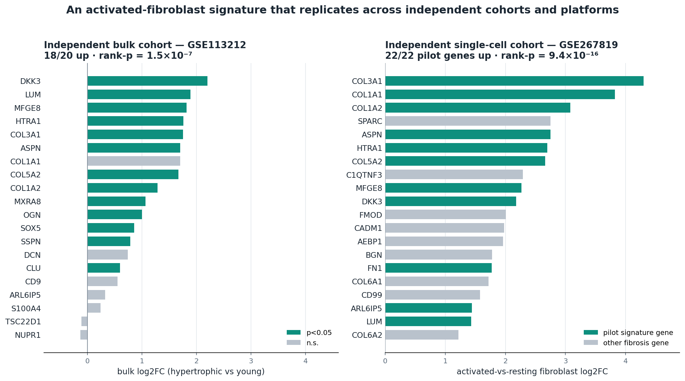

# Ligamentum flavum hypertrophy — replicated fibroblast signature & anti-fibrotic repurposing

Companion code for the preprint:

**A cross-platform-replicated activated-fibroblast signature in ligamentum flavum hypertrophy nominates locally-deliverable anti-fibrotic repurposing candidates**
Glen Charles Ritschel (Ritschel Research) · Claude (Anthropic)
Preprint (CC-BY): https://doi.org/10.5281/zenodo.21726983

## What this is

A discovery-stage, fully in-silico analysis of ligamentum flavum (LF) hypertrophy, a fibrotic driver of degenerative lumbar spinal stenosis with no approved pharmacotherapy. From public human single-cell RNA-seq we derive a within-tissue **activated-fibroblast** program and show it **replicates across platforms** in an independent bulk cohort. We then nominate approved anti-fibrotic repurposing candidates by mechanism, and position them honestly against existing prior art. This is a hypothesis intended to motivate wet-lab evaluation; it is **not** preclinical validation.

## Key result

The single-cell-derived activated-fibroblast signature (fibrillar collagens, SLRP proteoglycans, HTRA1, MFGE8, POSTN, FN1, S100A4) reproduces across **two independent single-cell cohorts and one independent bulk cohort on a different platform**:

- **GSE267819** (independent single-cell, 3 hypertrophic donors, 13,567 fibroblasts): all **22/22** signature genes up in activated fibroblasts, rank-enrichment **p = 9.4e-16**.
- **GSE113212** (independent bulk microarray): **18/20** genes concordant, rank-enrichment **p = 1.5e-7**, despite bulk-tissue dilution and an age-based contrast.

## Data (public)

- **GSE294458** — human LF single-cell RNA-seq (10x Genomics; 1 hypertrophic vs 1 non-hypertrophic). Discovery.
- **GSE267819** — human LF single-cell RNA-seq (10x Genomics; 3 hypertrophic donors; Ham et al.). Independent single-cell replication.
- **GSE113212** — human LF bulk microarray (Agilent; 4 elderly/hypertrophic vs 4 young). Independent bulk replication.

No unpublished or author-provided data are used. Notebooks download the data directly from GEO.

## Notebooks (run top-to-bottom on Google Colab)

| Notebook | Purpose |
|---|---|
| `notebooks/LF_GSE294458_pilot.ipynb` | Single-cell QC (incl. erythrocyte removal), compartment annotation, and the within-fibroblast activated-vs-resting **state** signature. Exports the UP-anchored signature. |
| `notebooks/LF_GSE267819_replication.ipynb` | Independent **single-cell** replication: derives the activated-vs-resting signature in a second LF scRNA cohort (GSE267819) and tests concordance with the pilot (22/22 genes up, p = 9.4e-16). |
| `notebooks/LF_GSE113212_replication.ipynb` | Cross-platform replication test of the signature in independent bulk LF (differential expression + rank enrichment). Produces the figure. |
| `notebooks/LF_L1000_reversal_dryrun.ipynb` | Connectivity-based reversal (LINCS L1000 / L1000CDS2) with guards — an **informative negative** (see below). |
| `notebooks/LF_reversal_v2_approved.ipynb` | UP-anchored reversal filtered to approved, non-oncology drugs via the Broad Drug Repurposing Hub. |

## Method notes

- The disease signature is built as a **within-tissue cell-state contrast** (activated vs resting fibroblast), not a case-vs-control contrast, so it is robust on minimal data and is validated by **cross-platform replication** before use.
- **Connectivity mapping was uninformative.** L1000 reversal returns cytotoxic / anti-proliferative perturbagens; the gentle, pleiotropic anti-fibrotics of interest produce weak L1000 signatures and are structurally disfavored by connectivity ranking. Candidates are therefore nominated by **mechanism**, not by connectivity score. See the preprint and `PRIOR_ART.md`.

## Candidates & prior art

Mechanism-matched approved anti-fibrotics: **nintedanib** (lead; PDGFR/FGFR/VEGFR) and **pirfenidone** (TGF-β1), both amenable to local intra-ligamentous delivery. See `PRIOR_ART.md` for the honest novelty positioning (LF hypertrophy vs post-surgical epidural fibrosis; the pending Pitt miR-29a application) and why this is **published openly rather than patented**.

## Reproducing

Open each notebook in Google Colab and `Runtime → Run all`. CPU runtime is sufficient (no GPU needed). Notebooks are self-contained; the reversal notebooks embed the pilot signature as a fallback.

## Citation

Ritschel G.C., Claude (Anthropic). *A cross-platform-replicated activated-fibroblast signature in ligamentum flavum hypertrophy nominates locally-deliverable anti-fibrotic repurposing candidates.* Zenodo, 2026. https://doi.org/10.5281/zenodo.21726983

## License

Code: MIT (see `LICENSE`). Text/figures in the preprint: CC-BY-4.0.

## Disclaimer

Discovery-stage computational research with illustrative, not measured, pharmacology. Not medical or legal advice. No patent has been filed; the work is released openly.
